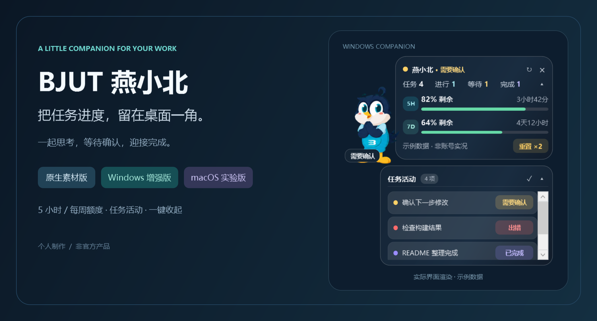

<div align="center">

# BJUT 燕小北 · Codex Pet

**个人制作、个人维护**，让燕小北陪你写代码，把任务和额度留在桌面一角。

原生素材版 · Windows 增强版 · macOS 增强版（实验性）

当前版本 **0.2.6**。不会安装？先看 [零基础安装步骤](docs/BEGINNER.md)；下载解压后双击 **START-HERE.html**，直接用浏览器阅读，无需开发工具。

0.2.6 将 Codex App Server 的运行时状态作为任务探测主信号，修复全新电脑、不同安装渠道和不同数据目录下始终显示空闲的问题；Windows 增加可双击的原目录更新程序和可选保留数据的卸载程序，并在 Codex 关闭后自动结束桌宠。任务活动仍只跟踪 Codex，不读取普通 ChatGPT 聊天状态。请确认下载包内 VERSION.txt 为 0.2.6，不要混用旧文件。

[安装指南](docs/INSTALL.md) · [Mac 专用指南](docs/MACOS.md) · [效果展示](docs/PREVIEW.md) · [常见问题](docs/FAQ.md)



</div>

本项目不是 OpenAI、北京工业大学或角色权利方的官方产品。代码采用 [MIT](LICENSE.md)；角色图片不适用 MIT，相关使用限制见 [常见问题](docs/FAQ.md)。

## 选哪个版本？

| | 原生素材版 | Windows 增强版 | macOS 增强版 |
| --- | --- | --- | --- |
| 目录 | `codex-native/bjut-yanxiaobei` | `windows-companion` | `macos-companion` |
| 运行方式 | Codex 自带桌宠加载素材 | PowerShell / WPF 独立窗口 | Electron 独立透明窗口 |
| 任务状态 / 折叠列表 | 由官方宿主提供 | 自带 | 自带 |
| 五小时 / 每周额度 | 不额外添加 | 剩余比例、倒计时 | 剩余比例、倒计时 |
| 可重置次数 | 不额外添加 | 接口提供时显示 | 接口提供时显示 |
| 日常入口 | 宿主桌宠设置 | Start.vbs | 构建后的 .app |
| 环境 | 支持 v2 本地宠物的宿主 | Windows、Node.js 22+、PowerShell、Codex | macOS 13+、Codex；源码安装/打包需 Node.js 22.12+ |
| 验证 | 格式已验证，Mac 宿主待实测 | Windows 回归测试通过 | 代码与跨平台界面已验证，Mac 实机待验证 |

三种版本互不依赖。只想留一只宠物，可隐藏 Codex 原生桌宠，再运行对应系统的增强版。Windows 文件不能直接在 Mac 运行，Mac 请使用新增目录。

> 当前 0.2.6 提供 Mac **源码运行包与 .app 构建流程**，不是已经签名、公证、实机验收的 Mac 安装包。没有 Linux 增强版；Windows 可原目录自动更新，Mac 源码包仍提醒并打开 GitHub Release。

## 快速开始

### A. 原生素材版

1. 完整解压，把内层 `codex-native/bjut-yanxiaobei` 复制到 Codex 数据目录的 `pets` 下。
2. Windows 默认目标为 `%USERPROFILE%\.codex\pets\bjut-yanxiaobei`；Mac 为 `~/.codex/pets/bjut-yanxiaobei`。设置过 `CODEX_HOME` 时使用该目录。
3. 在支持自定义桌宠的客户端刷新宠物列表，选择 BJUT 燕小北并显示。菜单随客户端版本变化。[官方桌宠说明](https://learn.chatgpt.com/docs/pets)

Windows 也可运行 `scripts/Install-CodexPet.ps1`；首次不覆盖同名目录，明确加 `-Force` 才会备份后更新。[安装和卸载](docs/INSTALL.md)

### B. Windows 增强版

1. 安装并登录 Codex，确认能够执行任务。
2. 安装 [Node.js 22+](https://nodejs.org/en/download)，启用 PATH；默认入口使用 Windows PowerShell 5.1。
3. 完整解压，进入 `windows-companion`，双击 **Start.vbs**。
4. 右键可分别隐藏额度气泡、任务队列，或关闭桌宠。

无需 `npm install`、API Key 或原生版。正常入口不留下终端；排错用 `Start-Debug.cmd`，该入口故意保留终端。[详细指南](docs/INSTALL.md)

### C. macOS 增强版（首次安装）

要求 **macOS 13+**、已登录的 Codex。源码安装需 Node.js 22.12+、npm 和网络。系统下限由 [Electron 44 官方说明](https://www.electronjs.org/docs/latest/breaking-changes/#removed-macos-12-support) 确认。

解压后，在终端输入 `cd `（含空格），把 `macos-companion` 文件夹拖入终端，再按回车：

```sh
npm ci
npm run prepare-assets
npm test

# Apple Silicon（M 系列）
npm run pack:arm64

# Intel Mac 改用下面这一条，不用两条都运行
# npm run pack:x64
```

在生成的 `dist` 子目录中找到 **BJUT YanXiaoBei.app**，复制完整应用到你的“应用程序”文件夹，双击启动。之后不用打开终端，也不依赖系统 Node.js。

首次连接不成功时，右键 → **选择 Codex 应用… / 选择 Codex CLI…**。不要上传登录文件。源码直接运行、签名限制、自启动、更新卸载和排错均见 [Mac 完整指南](docs/MACOS.md)。

## 日常操作

| 操作 | 增强版行为 |
| --- | --- |
| 拖动角色或面板顶部 | 移动窗口，限制在工作区；垂直拖动不虚构左右跑动 |
| 双击角色 | Windows 恢复已有窗口；Mac 激活已有应用，不主动导航到首页 |
| 点击任务摘要 / 收起箭头 | 展开或收回任务队列 |
| 点击任务行 | 打开对应本机 Codex 任务；列表保留 `Codex` 来源标识 |
| 气泡右上角 × | 仅隐藏额度气泡 |
| 右键 | 显隐面板、刷新、清除提醒、关闭桌宠 |
| Mac 菜单栏图标 | 找回桌宠和位置；提供相同菜单 |
| “重置 ×N” | **只显示，不兑换**；未知为 `--`，明确零次才显示 `×0` |

Windows 新安装首次启动后默认启用“跟随 Codex 启动”观察器，右键可关闭并保持这一选择。Mac 新安装默认跟随显示；打包 .app 首次运行会尝试启用登录项，源码运行不会。两个系统都可从右键打开离线“使用说明”。Mac 的“跟随 Codex 显示/隐藏”只在桌宠已运行时生效，与登录自动运行不是同一机制。

## 动画与效果

| 思考 | 需要确认 | 完成 | 出错 |
| --- | --- | --- | --- |
|  |  |  |  |

两种增强版复用 57 张帧图和同一时序，出错循环为 **3.6 秒**；同状态刷新不重启动画。Mac 开启系统“减少动态效果”时使用静帧。原生版由宿主控制速度。

[完整效果展示](docs/PREVIEW.md) 使用虚构任务与额度。

## 注意事项

- 使用本机 app-server、Codex 会话生命周期和桌面日志，不是稳定的第三方插件接口；客户端更新可能影响兼容性。任务活动只显示 Codex，不读取普通 ChatGPT 聊天状态。部分 Codex 客户端的进程或日志目录仍可能包含 `ChatGPT` 名称，这是安装兼容处理，不是 Chat 状态检测。
- “已结束仍思考”的修复已共用到 Mac：正常完成不依赖系统完成通知；主动停止不算成功；心跳过期显示离线。
- 多任务优先级：需要确认 → 出错 → 完成 → 执行中 → 空闲。活动列表不是 Codex 侧栏全部任务。
- 两端缺少桌面日志时尝试近期本机顶层任务会话；审批、其他设备及没有本地状态记录的活动不保证覆盖。
- 数据以官方客户端为准；项目不购买、兑换额度，不代替用户确认审批。
- Mac 默认构建未进行 Developer ID 签名/公证，不应关闭 Gatekeeper 等全局安全功能绕过问题。
- 不上传 `.codex`、`auth.json`、原始日志、真实任务缓存或合同个人信息。[隐私说明](docs/PRIVACY.md)

## 项目结构

```text
bjut-yanxiaobei-codex-pet/
├── codex-native/bjut-yanxiaobei/  # 原生 v2 素材
├── windows-companion/           # Windows 程序、共享状态/时序/帧图源
├── macos-companion/             # Electron 程序、锁文件、测试、启动器
│   ├── runtime/                 # 共享数据桥校验副本
│   └── assets/                  # 同步的时序、帧图与许可
├── docs/                        # 使用、效果、隐私、架构和分包说明
├── scripts/                     # 安装、测试、素材和 ZIP 打包
├── tests/                       # Windows 与共享逻辑测试
└── .github/workflows/           # 手动 Mac 构建，不自动发布
```

## 开发与发布

Windows 回归：`powershell -NoProfile -ExecutionPolicy Bypass -STA -File .\scripts\Test.ps1`。

Mac 开发：在 `macos-companion` 运行 `npm ci`、`npm run prepare-assets`、`npm test`。离线演示用 `npm run demo`。共享资源改动后必须重新同步，不能只改 Mac 副本。

源码打包：在 Windows 根目录运行 `powershell -NoProfile -ExecutionPolicy Bypass -File .\scripts\Package.ps1`，生成完整仓库、原生版、Windows 版、Mac 源码版四个 ZIP。

打包后运行 `powershell -NoProfile -ExecutionPolicy Bypass -File .\scripts\Audit-Release.ps1 -ReleaseDirectory .\dist`，逐文件比较四个 ZIP 与当前源码，并验证 SHA256SUMS.txt。源码静态检查可运行 `node scripts/Audit-Source.cjs`；结果不等于 Mac 实机验收或绝对无漏洞保证。

上传 GitHub 时，让 README.md 位于仓库根目录；只上传本项目的源码、素材与文档，不上传 `.test-output/`、`node_modules/`、运行配置、日志或备份。可先将完整项目 ZIP 解压到新文件夹再上传其内容。Release 标签使用 `v0.2.6`，附件放四个 ZIP 和 SHA256SUMS.txt；Mac 附件明确标注“实验性源码包”。本项目不会自动上传 GitHub 或触发云端构建。

仍需注意：Mac 实机、签名/公证与预编译安装包待完成；Windows 需要 Node.js，并非独立 EXE 安装器。素材使用遵守本项目 FAQ，MIT 不覆盖角色图像。原生素材的 `spriteVersionNumber: 2` 是格式号，不是项目版本号；旧私人版和旧 ZIP 不属于当前发布，不要一起上传。
