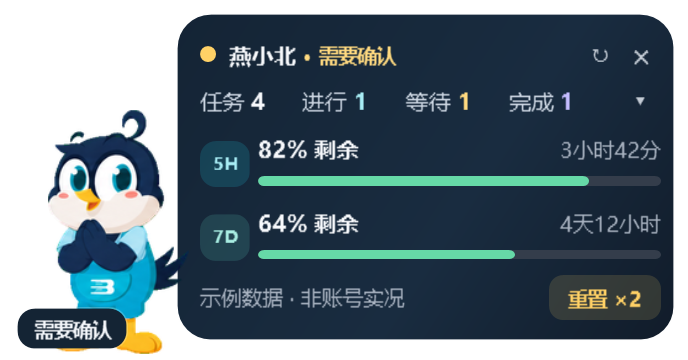
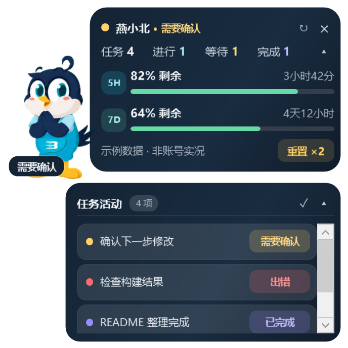
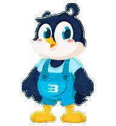
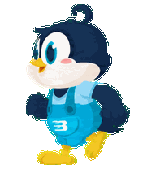
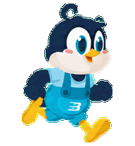
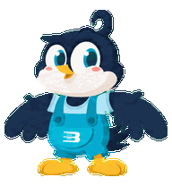
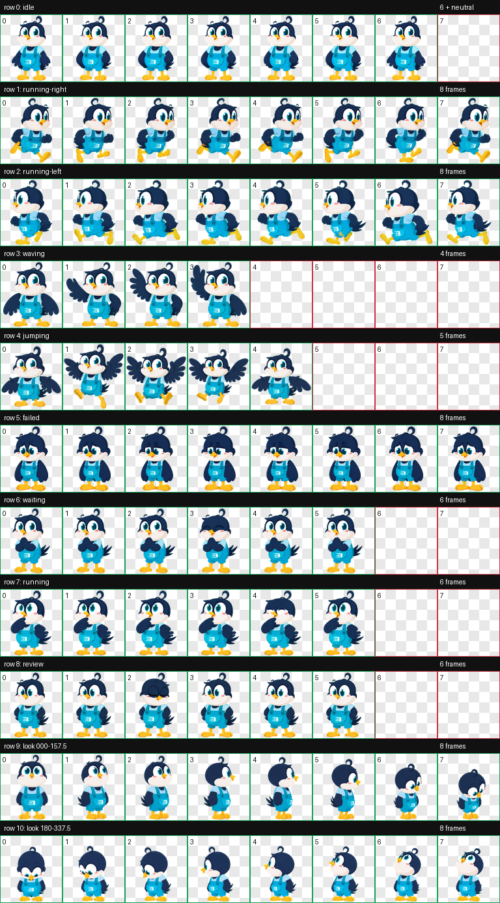

# 效果展示

[返回首页](../README.md)

## Windows 独立增强版

以下是实际 WPF 布局的离屏渲染，**不是账号实况截图**：任务标题、ID、额度和重置次数全部为示例。

| 紧凑模式 | 展开任务活动 | 纯桌宠 |
| --- | --- | --- |
|  |  |  |

两块面板可分别收起；完整窗口逻辑尺寸为 344 × 344，紧凑模式为 344 × 180，纯桌宠模式为 128 × 180。图像以 2 倍像素密度渲染，实际屏幕大小取决于 Windows 缩放设置。

## 动画动作

| 空闲 | 思考中 | 等待确认 |
| --- | --- | --- |
|  |  |  |

| 完成 | 出错 | 挥手 |
| --- | --- | --- |
|  |  |  |

| 向左移动 | 向右移动 | 跳跃 |
| --- | --- | --- |
|  |  |  |

上面的 GIF 与增强版实际播放共用时序配置。出错动作采用轻微垂头，循环为 3.6 秒；其他动作保持原节奏。挥手、跳跃包含在素材中，不代表增强版的每一个动作都绑定了单独的操作入口。

原生版由官方宿主控制时序，可对照查看 [原生出错动作预览](animations/native/failed.gif)。原生版同样使用小幅度动作，但不是 3.6 秒循环。

## 原生 v2 图集总览

本图为检查用联系表，不能替代安装用的 `spritesheet.webp`。安装文件位于 `codex-native/bjut-yanxiaobei/`。

## 复现静态展示图

在 Windows 仓库根目录运行 `scripts/Render-Previews.ps1`，输出到 `docs/images/`。脚本只使用本仓库素材和示例数据，不采集你的桌面，也不连接账号。

维护者重建动图时，可在安装 Pillow 的 Python 环境运行 `python scripts/Render-Animations.py`；它会生成增强版与原生版两套时序预览。
